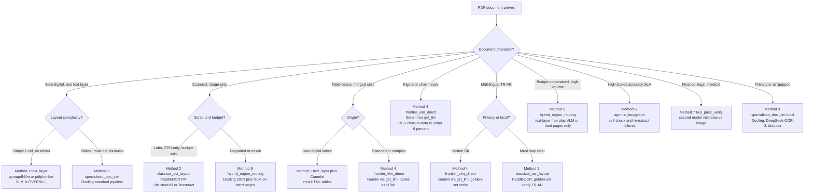
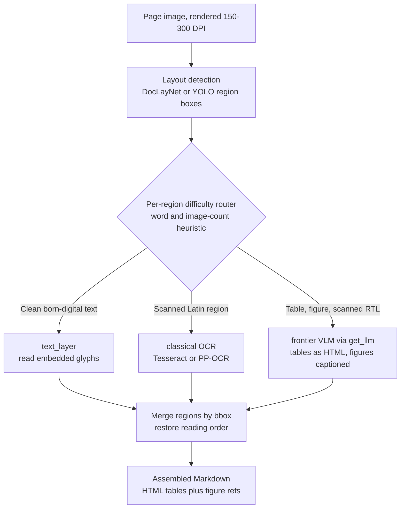
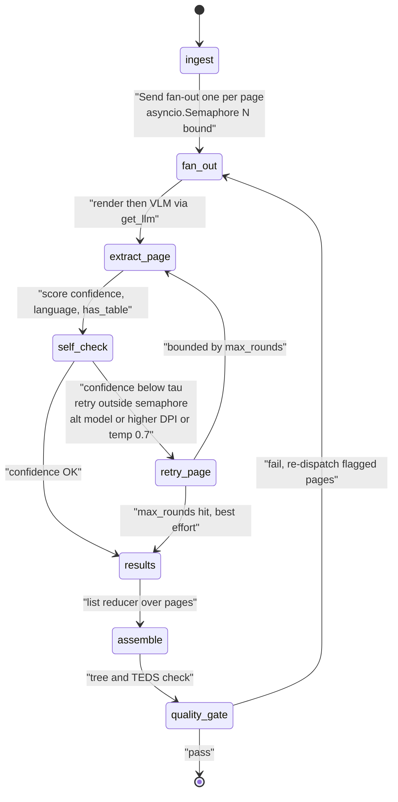
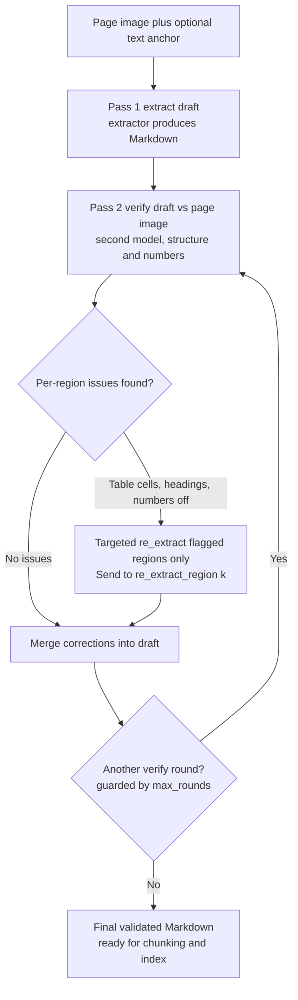
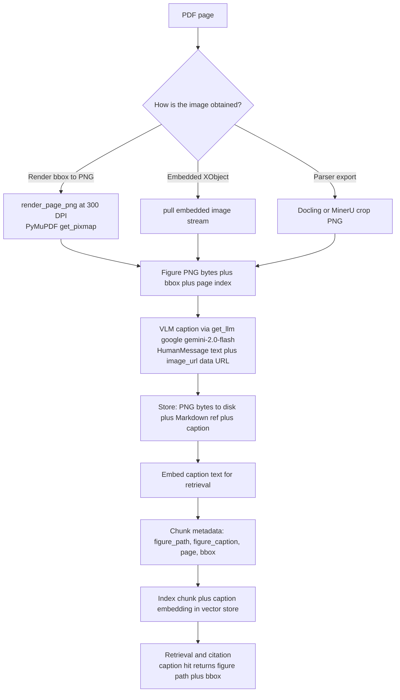

# PDF → Markdown extraction in 7 methods

> The **how-it-works** companion to [`FINDINGS.md`](FINDINGS.md) (the
> *why-this-way*, with benchmarks and graded evidence). Where `FINDINGS.md`
> tells you **which** method to reach for, this doc opens each one up:
> the architecture, an ASCII pipeline, exactly **what happens to an image**,
> when it is overkill, how it fails, and the **runnable demo** that proves it.
> Every VLM call here goes through the project's switchable provider layer —
> `get_llm("google", model="gemini-2.0-flash", temperature=0)` — never a raw
> SDK, matching the wiring rule in
> [`projects/vlm_extraction_harness/`](../../../projects/vlm_extraction_harness/README.md).

The seven methods form a **ladder of cost and capability**: free deterministic
text reading at the bottom, a self-correcting agentic graph and a second-model
verifier at the top. The trick in production is never to climb higher than the
page demands.

## Overview — the one-screen map

| # | Method | What it does | Runnable demo | When |
|---|---|---|---|---|
| 1 | **Text-layer extraction** | Reads the PDF's embedded glyph stream and serializes to Markdown — no rendering, no OCR | [`demos/m1_text_layer.py`](../../../projects/vlm_extraction_harness/demos/m1_text_layer.py) | Born-digital PDFs with a real text layer — the default first pass |
| 2 | **Classical OCR + layout model** | Rasterizes, detects typed regions + reading order, OCRs each region, reassembles Markdown | [`demos/m2_classical_ocr_layout.py`](../../../projects/vlm_extraction_harness/demos/m2_classical_ocr_layout.py) | Latin-script scans, CPU/offline, deterministic, zero API cost |
| 3 | **Specialised document VLM** | One local OCR-free transformer turns a page image into structured markup (DocTags → Markdown) | [`demos/m3_specialised_doc_vlm.py`](../../../projects/vlm_extraction_harness/demos/m3_specialised_doc_vlm.py) | Bulk/private/offline mixed text+table+figure docs; keeps real figure crops |
| 4 | **Frontier-VLM direct** | Renders the page to a 300-DPI PNG and prompts Gemini/GPT-4o/Claude to transcribe pixels → Markdown | [`demos/m4_frontier_vlm_direct.py`](../../../projects/vlm_extraction_harness/demos/m4_frontier_vlm_direct.py) | Visually complex / scanned / RTL / table- or figure-heavy pages, no local infra |
| 5 | **Hybrid region routing** | Segments the page, routes each region to the cheapest extractor that can win, merges by bbox | [`demos/m5_hybrid_region_routing.py`](../../../projects/vlm_extraction_harness/demos/m5_hybrid_region_routing.py) | Mixed real-world docs: mostly prose, a minority of hard regions — the cost sweet spot |
| 6 | **Agentic (LangGraph)** | Fans out one worker per page, self-checks confidence, re-extracts low-confidence pages at higher DPI | [`demos/m6_agentic_langgraph.py`](../../../projects/vlm_extraction_harness/demos/m6_agentic_langgraph.py) | Large/heterogeneous PDFs with uneven quality; per-page provenance + audit trail |
| 7 | **Two-pass / verification** | Pass 1 drafts cheaply; pass 2 a second VLM judges the draft against the page image and corrects | [`demos/m7_two_pass_verify.py`](../../../projects/vlm_extraction_harness/demos/m7_two_pass_verify.py) | High-stakes accuracy SLAs — finance, legal, medical, scientific tables |

The **image lifecycle** (the central question — extract → caption → store →
reference → embed → chunk metadata → index → cite) is documented in
[§ The image lifecycle](#the-image-lifecycle) and proven by
[`demos/image_lifecycle.py`](../../../projects/vlm_extraction_harness/demos/image_lifecycle.py).

---

## Big picture — how to choose

The methods map 1:1 to the taxonomy in [`FINDINGS.md` §4](FINDINGS.md). Start at
the cheapest method whose **floor** clears the page's **document character**, and
only climb when a real failure mode forces you up the ladder. Two axes dominate
the decision: *is there a usable text layer?* (born-digital vs scanned) and
*how visually complex is the page?* (prose vs tables/figures/RTL).



**Reading the tree.** A clean born-digital single-column page goes to Method 1
and stops — a VLM there buys cost, latency, and a 12.4% hallucination risk for
zero quality gain. Push up only when something the text layer cannot do appears:
a scan (→ 2/4), a figure you must *understand* (→ 4), a complex table (→ 4/5), or
a correctness SLA (→ 6/7). Method 5 is the production default for *mixed* corpora
because it pays VLM rates only on the hard fraction of pixels.

---

## 1. Text-layer extraction

> Read the PDF's embedded glyph stream directly and serialize to Markdown —
> no rendering, no OCR; **born-digital only**.

**Architecture steps**

1. **Open the PDF container** — the reader (PyMuPDF under pymupdf4llm, or pdfplumber) parses the PDF's object graph and content streams. No pixels are produced; each page object exposes its content stream of drawing operators.
2. **Decode the glyph stream** — text-showing operators (`Tj`/`TJ`) plus the active font's ToUnicode CMap are walked to recover every glyph as a positioned record (Unicode codepoint, font, size, x/y bbox). pdfplumber surfaces these as `page.chars`; PyMuPDF builds an equivalent text dict of spans/lines/blocks.
3. **Detect text-layer presence (gate)** — count recovered glyphs. Zero chars ⇒ no text layer (scanned page); the method must bail to OCR (#2) or a VLM (#4). This cheap, deterministic gate defines the method's floor.
4. **Infer structure from geometry + fonts** — headings from relative font sizes; paragraphs/lists from line spacing and x-indent; columns from x-gap clustering; tables from real vector ruling lines (PyMuPDF `lines_strict`) or a ruled-grid analysis (pdfplumber `find_tables`/`extract_tables`). No model is consulted.
5. **Order into reading sequence** — blocks are sorted into human reading order (top-to-bottom within a column, then left-to-right across columns). Multi-column pages scramble here if the column clustering is wrong.
6. **Serialize to Markdown** — pymupdf4llm emits GitHub-flavored Markdown directly from the structured blocks; pdfplumber returns raw text + table cell matrices for a transparent cross-check. Output is final — no second pass.

```text
PDF bytes
   |
   v
[Open container]  parse objects + content streams  (no raster)
   |
   v
[Decode glyph stream]  Tj/TJ + ToUnicode CMap -> chars{unicode, font, size, bbox}
   |
   v
[Gate] char_count == 0 ? ---yes--> NO TEXT LAYER (scanned) -> bail to OCR(#2)/VLM(#4)
   | no
   v
[Structure] font-size -> headings ; x/y gaps -> columns/paras ; vector rules -> tables
   |
   v
[Reading order]  sort blocks (column-first, top->bottom)
   |
   v
[Serialize] -> Markdown (headings/lists/tables)   <-- figures referenced by bbox only, pixels NOT decoded
```

**Image handling.** Figures are seen only as **placement metadata**, never
interpreted. The glyph stream contains image XObject *invocations* (a `Do`
operator referencing an image resource), so the reader knows an image exists and
where it sits — pdfplumber exposes each as a `page.images` entry with name, bbox,
`srcsize`, and colorspace. The demo records those bboxes but does **not** decode
the pixels; pymupdf4llm is run with `ignore_images=True` so figure pixels are
dropped entirely. Real glyphs *inside* a figure (e.g. a vector chart's axis
labels stored as font text) do come through, because they live in the glyph
stream; text baked into a raster image does not.

**What happens to the image.** A figure effectively **disappears** from the
output. With `ignore_images=True` the pixels are discarded and nothing is emitted
in its place; at most the figure survives as a known bounding box in the
pdfplumber audit dict and as whatever vector text was embedded within it. No
caption synthesis, no alt-text, no rendered crop, no chart-to-data — interpreting
figure pixels is explicitly out of scope and belongs to the VLM methods (#3/#4)
or hybrid routing (#5).

**When to use** — born-digital PDFs with a real embedded text layer; the default
first pass and the baseline that justifies (or rules out) heavier methods.

**When overkill / fails** — fails on scanned/image-only pages, outlined text, or
broken ToUnicode maps; degrades on multi-column layout, merged-cell tables, and
figures.

**Failure modes**

- Scanned / image-only page: zero glyphs, output silently empty (the hard floor) — must gate on `char_count`.
- Outlined fonts / text-as-vector-paths: looks rendered but yields no recoverable text.
- Missing/broken ToUnicode CMap: glyphs decode to mojibake / private-use codepoints, often unnoticed.
- Multi-column scramble: columns merged L→R instead of column-first, interleaving sentences.
- Merged-cell tables: colspan/rowspan flattened or duplicated (Markdown pipes can't represent them).
- Figures and charts lost entirely; captions survive only as nearby loose text.
- Spacing/word-join errors from `x_tolerance` heuristics; dropped ligatures.
- RTL scripts (Arabic/Hebrew): visual vs logical order can invert if the producer stored glyphs visually.

**Representative tools** — pymupdf4llm · pdfplumber · PyMuPDF (`get_text`, text dict) · pdfminer.six

**Setup**

```bash
uv sync --extra extraction    # or: uv add pymupdf4llm pdfplumber
```

**Demo** → [`projects/vlm_extraction_harness/demos/m1_text_layer.py`](../../../projects/vlm_extraction_harness/demos/m1_text_layer.py)

---

## 2. Classical OCR + layout model

> Rasterize the page, run a layout detector to find regions and reading order,
> OCR each region with a recognition engine, then reassemble Markdown — the
> pre-VLM SOTA that still wins on Latin scans, CPU, and offline.

**Architecture steps**

1. **Rasterize page** — render to a raster at high DPI (300 is the floor; below ~200 DPI recognition collapses) via `page.get_pixmap(dpi=dpi).tobytes("png")`. The glyph stream is ignored entirely — everything downstream sees pixels only.
2. **Optional pre-processing** — deskew, orientation/script detection (OSD), binarization, denoise. Tesseract PSM 1 folds OSD in; PP-StructureV3 offers doc-orientation + unwarping toggles. Skew or upside-down scans wreck OCR if skipped.
3. **Layout detection + region typing** — a layout model segments the page into typed regions (text, title, list, table, figure, formula, header/footer). PP-StructureV3 uses a trained detector; the Tesseract path uses the engine's own block/paragraph/line hierarchy as a poor-man's layout model.
4. **Reading-order sorting** — regions are sorted into human reading order (column-first, RTL for Arabic). PP-StructureV3 has an explicit step; the Tesseract path infers order from the TSV block/par/line numbering. Make-or-break for multi-column papers.
5. **Per-region recognition (OCR)** — each text region is fed to the recognition engine with the correct language model (eng/tur/ara). Table regions go to a dedicated table-structure recognizer; formula regions to a formula recognizer. Output is text plus per-word boxes and confidences.
6. **Reassemble Markdown** — regions serialized in reading order: text → paragraphs, titles → headings, tables → Markdown/HTML from the recovered cell grid, figures → image placeholders with nearby captions. PP-StructureV3 emits Markdown natively (`res.markdown` + `concatenate_markdown_pages`).

```text
PDF page
   |
   v  render @300 DPI (PyMuPDF get_pixmap)
[ raster image (PNG) ]
   |
   v  deskew / OSD / binarize
[ cleaned image ]
   |
   v  LAYOUT MODEL  (PP-StructureV3 detector | Tesseract PSM-1)
[ typed regions: text | title | table | figure | formula ]
   |
   v  reading-order sort (column-first / RTL)
[ ordered region list ]
   |
   +--> text region  --> OCR engine (PP-OCR | Tesseract, lang=eng/tur/ara) --> text + boxes + conf
   +--> table region --> table-structure recognizer --> cell grid --> per-cell OCR
   +--> figure region --> crop bbox (no OCR) --> image placeholder + caption
   |
   v  reassemble in reading order
[ Markdown: headings / paragraphs / tables / image refs ]
```

**Image handling.** A figure is treated as **geometry, never interpreted**: the
layout detector emits a typed `figure` bbox, OCR is *not* run inside it, and the
figure pixels are cropped from the rendered raster by that bbox. PP-StructureV3
saves the crop and inserts a relative Markdown image reference at the figure's
reading-order position; the Tesseract fallback has no figure detector so figure
pixels are dropped. Captions are recovered only as ordinary adjacent text
regions, associated positionally, not semantically.

**What happens to the image.** The figure survives as a **pixel crop + Markdown
image reference** at its reading-order position, with the caption attached as
nearby text; its semantic content (chart values, diagram meaning, axis labels) is
lost. You get a faithful *figure-here* placeholder, not an extraction — the
opposite of a VLM method.

**When to use** — Latin-script scans with no text layer, on CPU/offline, where
deterministic, auditable, zero-API-cost extraction matters more than figure
understanding.

**When overkill / fails** — overkill on born-digital PDFs with a clean text layer
(Method 1 is faster and lossless). Fails or underperforms on complex
figures/charts where you need the data, heavily merged tables, sub-200-DPI/noisy
scans, handwriting, exotic layouts, and any language without a trained model.
When figure comprehension or messy-table reasoning is the goal, a frontier or
specialised-doc VLM (#3/#4) is the better tool.

**Failure modes**

- Reading-order scramble on multi-column pages when the layout model mis-orders regions.
- Sub-200-DPI or noisy scans tank accuracy — garbage tokens, dropped lines.
- Missing/incorrect language pack: Turkish dotless-ı/dotted-İ casing errors; Arabic RTL + glyph-joining failures → mojibake.
- Merged-cell tables collapse — wrong cell grid shifts numbers into wrong columns.
- Figures yield only a placeholder + caption; chart data and diagram meaning lost.
- Skewed/rotated scans without OSD/deskew cause whole-region OCR failure.
- Footnotes/captions crossing column boundaries get mis-associated.
- Tesseract path has no figure/table model → flat text with broken structure on complex pages.

**Representative tools** — PaddleOCR **PP-StructureV3** (layout + reading order +
table recognition + PP-OCR → Markdown) · pytesseract / Tesseract · PaddleOCR
PP-OCR · docTR (Mindee) · PP-DocLayout / LayoutParser / PubLayNet Detectron2 ·
PyMuPDF (rasterization)

**Setup**

```bash
uv sync --extra extraction   # PyMuPDF (render) + Pillow + numpy
uv add pytesseract paddleocr # the two OCR backends
# pytesseract also needs the native Tesseract engine + lang packs on PATH:
#   Windows: UB-Mannheim Tesseract build + tur/ara language data
#   macOS:   brew install tesseract tesseract-lang
#   Linux:   apt-get install tesseract-ocr tesseract-ocr-tur tesseract-ocr-ara
# paddleocr also needs a paddlepaddle build for your platform.
```

**Demo** → [`projects/vlm_extraction_harness/demos/m2_classical_ocr_layout.py`](../../../projects/vlm_extraction_harness/demos/m2_classical_ocr_layout.py)

---

## 3. Specialised document VLM (OCR-free image→markup transformer)

> A single end-to-end, locally-run vision model converts a rendered page image
> directly into structured markup (Markdown/DocTags/HTML), replacing the whole
> OCR + layout-heuristics stack.

**Architecture steps**

1. **Render / ingest page** — Docling rasterizes each page internally (and, for born-digital PDFs, can also read the text layer). `DocumentConverter.convert()` owns the render. For the pure VLM pipeline every page becomes a single image fed to the model.
2. **Model inference (image → markup)** — either (a) Docling's standard pipeline runs a layout model + table-structure model, or (b) the `VlmPipeline` runs **one** end-to-end transformer (Granite-Docling / SmolDocling) emitting **DocTags** — structured markup describing every element with its relations. No discrete OCR engine; glyph recognition is fused into the model.
3. **Structured-document assembly** — output is parsed into a `DoclingDocument`: a typed tree of `TextItem`/`TableItem`/`PictureItem`/`SectionHeaderItem` nodes carrying bounding boxes, reading order, and table cell structure (incl. spans). This intermediate is format-agnostic — not yet Markdown.
4. **Figure pixel extraction (this method's signature feature)** — with `generate_picture_images=True` and `images_scale` set, Docling keeps the real PIL crop for each `PictureItem`. `document.iterate_items()` yields each `PictureItem`; `element.get_image(document)` returns the cropped figure, saved as PNG.
5. **Serialize to target format** — `export_to_markdown()` (or `save_as_markdown` with `ImageRefMode.REFERENCED`/`EMBEDDED`, or `save_as_html`) walks the tree. Tables become HTML/Markdown with structure preserved; figures become references to the saved crops (REFERENCED) or inline base64 (EMBEDDED).

```text
  PDF page
     │
     ▼
┌──────────────┐      rasterize (internal)
│  DocumentCon-│ ───────────────► page image(s)
│  verter      │
└──────┬───────┘
       │
       ▼   ── ONE local model, no separate OCR ──
┌───────────────────────────────────────────────┐
│  (a) standard pipeline: layout + table models  │
│  (b) VlmPipeline: Granite-Docling/SmolDocling  │
│      image ─────────────────► DocTags markup   │
└──────┬─────────────────────────────────────────┘
       │
       ▼
┌──────────────────┐   PictureItem.get_image(doc)
│ DoclingDocument  │ ──────────────────────────► figure-N.png  (real pixels)
│ (typed tree:     │
│  text/table/pic) │
└──────┬───────────┘
       │ export_to_markdown / save_as_markdown(REFERENCED)
       ▼
  Markdown + HTML tables + 
```

**Image handling.** Concrete and **non-hallucinating**: Docling locates each
figure as a `PictureItem` with a real bbox and, when
`generate_picture_images=True` (plus `images_scale`, e.g. `2.0` ≈ 144 DPI),
retains the actual cropped PIL image. You iterate `document.iterate_items()`,
`isinstance`-check `PictureItem`, call `element.get_image(document)`, then
`.save(path, format="PNG")`. The pixels come straight off the rasterized page —
the model is **not** asked to describe or redraw the figure. Charts/diagrams are
preserved as bitmaps; captions are recovered separately as nearby `TextItem`
nodes and kept associated in reading order.

**What happens to the image.** A figure becomes a **real PNG on disk** (e.g.
`figure-3.png`), and the exported Markdown carries a reference to it —
`` in REFERENCED mode, or an inline base64 data URI in EMBEDDED
mode. The pixels are the **original page crop, not a model reconstruction**, so
the figure survives losslessly at the chosen `images_scale`. The model's
contribution is structural only: where it is, its reading-order position, its
caption association. It does **not** turn the figure into prose or data unless you
separately run a picture-description enrichment.

**When to use** — bulk/offline/private extraction with no per-page API cost; mixed
text+table+figure documents where you need real figure crops preserved and
reproducible local output.

**When overkill / fails** — overkill for clean born-digital prose (use Method 1).
The VLM pipeline is heavy and slow on CPU and can hallucinate on
out-of-distribution pages with no fallback; a one-off page is simpler via a
frontier VLM (#4).

**Failure modes**

- VLM weights are multi-GB and slow on CPU; first run downloads them — fails silently-slow without a GPU/MLX backend.
- Out-of-distribution pages (handwriting, dense formulas, rare scripts) → hallucination/omission, no confidence signal, no API fallback.
- Reading-order / table-structure errors on extreme multi-column / merged-cell layouts (golden G3/G4) — DocTags tree can mis-nest cells.
- Low-resource scripts: Turkish casing and Arabic RTL joining (golden G6/G6b) unverified, may regress.
- If `generate_picture_images` is off, figures collapse to empty/placeholder refs — real pixels lost.
- Version drift: `vlm_model_specs` names and `PdfPipelineOptions` fields move between releases; pin versions.
- Scanned-only pages work (OCR-free) but quality tracks raster DPI — too-low `images_scale` degrades small text.

**Representative tools** — **Docling** (DocumentConverter standard pipeline +
VlmPipeline) · **Granite-Docling** (IBM) · SmolDocling
(`SMOLDOCLING_TRANSFORMERS`/`_MLX`) · Surya · Nougat (scientific PDFs, LaTeX) ·
GOT-OCR2.0

**Setup**

```bash
uv add docling docling-core pymupdf   # then: uv sync --extra extraction
```

**Demo** → [`projects/vlm_extraction_harness/demos/m3_specialised_doc_vlm.py`](../../../projects/vlm_extraction_harness/demos/m3_specialised_doc_vlm.py)

---

## 4. Frontier-VLM direct (page-as-image)

> Rasterize each page to a high-DPI PNG and prompt a frontier multimodal model
> (Gemini/GPT-4o/Claude) to transcribe the pixels directly into Markdown — no
> local parsing, OCR, or layout engine.

**Architecture steps**

1. **Render page to image** — PyMuPDF rasterizes **one** page to PNG at 300 DPI (`page.get_pixmap(dpi=dpi).tobytes("png")`). We render crisply ourselves because frontier APIs internally downsample uploaded PDFs to ~90 DPI, producing "full of errors" output (FINDINGS §5). The whole page — every figure/table/glyph — is now a flat bitmap; no text layer is consulted.
2. **Encode as base64 data URI** — PNG bytes are base64-encoded and wrapped as `data:image/png;base64,<...>`. Gemini scales any image down/pads to a 3072×3072 box preserving aspect ratio; a 300-DPI Letter/A4 page stays under that, so no client-side downscale is needed. Oversized pages would be tiled, not shrunk.
3. **Build the locked multimodal prompt** — a single `HumanMessage` carries two content parts: a text part (the locked extraction prompt) and an `image_url` part (the data URI). The prompt encodes the §5 playbook: column-first reading order, RTL handling, HTML tables for merged cells, LaTeX for formulas, figure-as-caption, and an explicit *do not hallucinate / write `[UNREADABLE]`* clause.
4. **Invoke through the switchable adapter** — `vlm = get_llm("google", model="gemini-2.0-flash", temperature=0); vlm.invoke([message])`. The model is reached **only** via `get_llm`, so it stays provider-switchable and inherits `Runnable.with_fallbacks`. The VLM reads the image holistically — layout, reading order, OCR, table structure all happen implicitly inside the model.
5. **Return Markdown** — `out.content` is the page transcribed as GitHub-flavored Markdown (embedded HTML tables and LaTeX). For multi-page docs the loop runs per page and the per-page Markdown is concatenated. No bbox merge, no reassembly — the model already produced linear reading order.

```text
PDF page
   |
   v
[PyMuPDF render 300 DPI] --> PNG bytes
   |
   v
[base64 -> data:image/png;base64,...]
   |
   v
HumanMessage(content=[
   {text: LOCKED_PROMPT},          <-- reading-order / HTML tables / LaTeX / no-hallucinate
   {image_url: data-URI}           <-- the WHOLE page as pixels
])
   |
   v
get_llm("google", model="gemini-2.0-flash", temperature=0).invoke([msg])
   |               (switchable adapter + .with_fallbacks)
   v
out.content  ===>  Markdown (HTML tables, $LaTeX$, )
   |
   v
(repeat per page -> concatenate)
```

**Image handling.** The **entire page** — prose, tables, AND figures — is
flattened into one raster and handed to the model as a single image. This method
does **not** crop, detect, or extract embedded figure objects; there is no
bbox segmentation. A figure is just another region of pixels the VLM sees. By
prompt instruction, each figure is represented textually as a Markdown image
placeholder with a model-written caption: ``.
The model is told to describe only what is visibly present and never invent data
points, but it has no access to the figure as a separate retrievable asset.

**What happens to the image.** A figure does **not** survive as a binary asset.
After the VLM processes the page, the figure exists only as the text it generated:
a caption inside a `` placeholder (the `figure` target is a
literal token, not a real file path or extracted PNG). The original pixels are
**discarded** once the page image is consumed. If you need the actual cropped
figure image, this method cannot give it to you — you must re-crop it yourself
from the rendered PNG using coordinates this method never produces. That is the
key trade-off versus hybrid/region routing (#5), which keeps figure crops as
first-class artifacts.

**When to use** — pages of extreme visual complexity where structural parsers
fail: scanned/image-only, RTL or mixed scripts, dense merged-cell tables,
formula- or figure-heavy layouts, degraded/multi-column docs — especially with
zero local GPU/infra and a wish for a single code path that "just works." Also
ideal as the **fallback tier** in a complexity router and as the ground-truth
oracle when bootstrapping a golden set.

**When overkill / fails** — overkill on born-digital, single-column, table-free
PDFs with a clean text layer: a frontier VLM adds cost, latency, and a **12.4%
hallucination risk** for zero quality gain (FINDINGS §4). It fails at high volume
on cost/throughput, in privacy-sensitive settings (page images leave your
boundary), and on dense-text pages where it silently invents plausible-but-wrong
cells that poison a downstream RAG index. It also loses cross-page structures (a
table spanning two pages becomes two unrelated halves).

**Failure modes**

- **12.4% hallucination** on dense text — invented cells/numbers that look correct and are undetectable downstream.
- Privacy/compliance: full page images sent to a third-party API; unsuitable for regulated docs without a private endpoint.
- Cost/throughput at volume — every page is a premium multimodal call.
- Cross-page blindness: page-spanning tables/lists become orphaned fragments (each page is an independent call).
- Provider auto-downsampling if you upload a raw PDF (~90 DPI) — mitigated by rendering 300-DPI PNGs ourselves; oversized pages must be tiled (Gemini 3072px box; Claude rejects >2000px/side in >20-image requests).
- Non-determinism / repetition loops at higher temperature; mitigated with `temperature=0` and an `[UNREADABLE]` escape hatch.
- No structured artifacts: figures/tables come back as text/HTML only — no cropped images, no bboxes, no confidence scores.

**Representative tools** — Google Gemini (`gemini-2.0-flash` / 2.5 / 3.x) via
langchain-google-genai · OpenAI GPT-4o / GPT-4.1 · Anthropic Claude (vision) ·
Zerox (render-then-VLM wrapper) · PyMuPDF (render step)

**Setup**

```bash
uv sync --extra extraction   # PyMuPDF for rendering
uv add langchain-google-genai  # the Gemini adapter behind get_llm("google")
```

**Demo** → [`projects/vlm_extraction_harness/demos/m4_frontier_vlm_direct.py`](../../../projects/vlm_extraction_harness/demos/m4_frontier_vlm_direct.py)

---

## 5. Hybrid pipeline (layout → region routing → VLM on hard regions only)

> Segment the page into typed regions, classify each by difficulty, run cheap
> text-layer/OCR on prose and a VLM **only** on figures/tables/scanned regions,
> then merge by bbox into reading order.

**Architecture steps**

1. **SEGMENT (layout oracle)** — a layout detector returns typed, bbox'd regions (Text, Title, Table, Picture, Caption, Header/Footer). In the demo PyMuPDF stands in: `page.get_text("dict")["blocks"]` yields text blocks (`type==0`) and image blocks (`type==1`); `page.get_image_info(xrefs=True)` catches XObject-reused images and supplies the xref. In production this is a trained model (Docling layout, PP-StructureV3, DocLayNet/YOLO) that *also* emits Table regions and column structure PyMuPDF cannot see.
2. **ROUTE (classify difficulty → pick a path)** — each region is tagged with the cheapest extractor that can win. Born-digital text → `text_layer` (free, lossless, Method 1 per-region). Figures/charts/scanned regions → `vlm`. A fuller router also sends Table regions (HTML output) and low-confidence/RTL regions to the VLM. **The whole value of the method lives here:** VLM dollars are spent only where text extraction cannot succeed.
3. **EXTRACT (per region, on its chosen path)** — text regions are already populated by the segmenter (zero extra cost). Figure regions are rendered to PNG clipped to just their bbox (`page.get_pixmap(clip=Rect(bbox), dpi=200)`) and sent to the VLM via `get_llm("google", model="gemini-2.0-flash", temperature=0)` with a caption-only, anti-hallucination prompt. A failed/blocked region degrades to a bbox placeholder. In the LangGraph shape (FINDINGS §4) this is a `Send` fan-out to N parallel `extract_region` workers with a list-reducer.
4. **MERGE (reassemble by bbox into reading order)** — regions sorted by bbox (top-then-left; column-bucket first for multi-column) and concatenated: text regions emit prose, figure regions emit `` so the chunker keeps a stable figure reference. A low-confidence region can loop back to re-extract before final assembly.

```text
                         PDF page
                            |
                            v
                 +----------------------+
                 |  SEGMENT (layout)    |   PyMuPDF get_text("dict") / get_image_info
                 |  -> typed bbox'd     |   (prod: Docling / PP-StructureV3 / DocLayNet)
                 |     regions          |
                 +----------+-----------+
                            |
                            v
                 +----------------------+
                 |  ROUTE by difficulty |
                 +----+------------+----+
                      |            |
            EASY (text)|            | HARD (figure/table/scanned)
                      v            v
        +-------------------+   +-----------------------------+
        | text_layer (free) |   | render crop @200dpi (clip)  |
        | glyph stream = MD  |   |  -> PNG -> get_llm("google")|
        +---------+---------+   |  -> caption / HTML table     |
                  |            +--------------+--------------+
                  |                           |
                  +------------+--------------+
                               v
                 +-----------------------------+
                 | MERGE by bbox (reading order)|
                 |  text -> prose               |
                 |  figure -> |
                 +--------------+--------------+
                                v
                      coherent Markdown stream
```

The LangGraph shape of the routing/fan-out/merge:



**Image handling.** Embedded figures are located as **first-class regions**, not
re-described from a whole-page screenshot. The segmenter gives each figure a bbox
(PyMuPDF image blocks `block["type"]==1`; `get_image_info(xrefs=True)` for
XObject-reused images). Each figure is then rendered **in isolation** by clipping
the page raster to exactly that rectangle —
`page.get_pixmap(clip=pymupdf.Rect(x0,y0,x1,y1), dpi=200).tobytes("png")` — so the
VLM sees one tight figure crop, not surrounding prose. The crop is base64-encoded
and passed as a `data:image/png;base64` `image_url` to `get_llm("google", ...)`. A
production layout model further separates Picture vs Table, so tables get rendered
and asked for HTML while pictures get a caption.

**What happens to the image.** The figure pixels are **not** inlined into the
Markdown. The VLM returns only a one-sentence caption (or HTML for a table), and
the merge step emits `` at the figure's reading-order
position. The caption is the chunk-visible representation while the original crop
can be written to disk and the bbox + caption carried as **chunk metadata**
(FINDINGS §5: figures as file-refs, captions as metadata). A figure thus becomes a
stable, searchable text anchor plus an optional saved image file — never a
hallucinated transcription of the whole page and never raw pixels in the index.

**When to use** — mixed real-world documents where most of the page is clean
born-digital prose but a minority of regions (charts, photos, scanned inserts,
complex tables) genuinely need a VLM. The production cost/latency sweet spot: pay
frontier-VLM rates only on the hard fraction of pixels, keep >10 pp/s on commodity
hardware, and dodge Method 4's dense-text hallucination because prose never
touches the VLM. Ideal for high-volume RAG ingestion (rag_qa_api_pro / Guillotine)
where born-digital pages dominate but you cannot assume every page is clean.

**When overkill / fails** — overkill for a homogeneous corpus: all clean
born-digital → Method 1 alone; all degraded scans → Method 4 or Method 3 without
the routing overhead. It also fails when the layout model mis-segments — a wrong
region boundary cascades (a table row merges with adjacent prose, a borderless
table reads as plain text) — a holistic end-to-end VLM (Method 4) would have
handled that page as one image.

**Failure modes**

- Layout mis-segmentation cascade: a wrong bbox boundary joins a table row with prose, or splits one figure into two; the router then sends the wrong pixels to the wrong path.
- Borderless / ruling-less tables are invisible to bbox-only segmenters (PyMuPDF entirely): read as ordinary prose, scrambling rows/columns into one corrupt chunk.
- Floating / overlapping elements (callouts, captions over images, watermarks) get ambiguous bboxes → wrong reading-order placement.
- Multi-column reading order: naive top-then-left sort merges columns L→R unless the segmenter supplies column structure.
- Scanned page with a thin/garbage text layer: the router trusts text-layer and skips the VLM, silently emitting wrong glyphs — needs a confidence gate.
- Per-region VLM caption drift: an isolated crop lacks page context; mitigated by also passing the nearby Caption region's text.
- Merge-seam artifacts: spacing/heading structure between many small regions can be lost if Title/heading levels aren't tagged.

**Representative tools** — MinerU (hybrid VLM+OCR) · Docling VLM pipeline ·
Unstructured (`hi_res` partition with element routing) · PP-StructureV3 (segmenter)
· DocLayNet/YOLO · PyMuPDF (demo segmenter + region renderer) · Gemini via
`get_llm("google", "gemini-2.0-flash")`

**Setup**

```bash
uv sync --extra extraction
uv add langchain-google-genai
```

**Demo** → [`projects/vlm_extraction_harness/demos/m5_hybrid_region_routing.py`](../../../projects/vlm_extraction_harness/demos/m5_hybrid_region_routing.py)

---

## 6. Agentic extraction (LangGraph self-correcting)

> A LangGraph `StateGraph` that fans out one worker per page, extracts each via a
> VLM through `get_llm`, self-checks confidence, re-renders/re-extracts
> low-confidence pages at higher DPI, and defers a fan-in assembler until every
> page (and its retries) settles.

**Architecture steps**

1. **ingest** — resolve the page count (PyMuPDF `doc.page_count`, or `num_pages` in mock mode). The only fact the fan-out router needs; writes `{num_pages}` to the shared `GraphState`. Heavy deps imported lazily with an install guard.
2. **fan_out (conditional edge / map step)** — a router on the ingest node returns `list[Send]` — one `Send("extract_page", PageState{page, dpi=200, model, attempt=1, ...})` per page. LangGraph launches every branch in the same superstep. This is the Lesson 30 map step: dynamic, runtime-sized fan-out.
3. **extract_page (per-page worker, parallel)** — each branch renders its page to PNG at base DPI, base64-encodes it, and calls the VLM via `get_llm("google", model, temperature=0).ainvoke([HumanMessage(content=[text, image_url])])`. Wrapped in a module-level `asyncio.Semaphore` (Lesson 27) so total in-flight VLM calls never exceed `MAX_CONCURRENCY` across all branches.
4. **self_check + bounded retry (in-branch)** — `score_confidence()` rates the page (0 for empty, penalties for `[UNREADABLE]` markers and suspiciously short text). If confidence < threshold and attempts ≤ `MAX_RETRIES`, the branch re-renders the **same** page at `RETRY_DPI` (350) with an alternate/stronger model and re-extracts — a local while-loop, **not** a graph edge. The loop lives inside the node because a conditional-edge router placed after a `Send`-reached node sees the *merged* graph state, not the branch's page id, which makes a graph-level per-page retry edge ambiguous once branches interleave.
5. **reduce (operator.add list channel)** — each branch returns `{"results": [PageResult]}`. The `results` channel is `Annotated[list, operator.add]`, so LangGraph concatenates every branch's contribution as branches complete.
6. **assemble (deferred fan-in / reduce barrier)** — registered with `add_node(..., defer=True)`. It runs **only** after every `extract_page` branch (including in-branch retries) has finished — a true synchronization barrier. It sorts results by page number and joins them into one Markdown document with per-page provenance comments (confidence, attempt, DPI).

```text
                              ┌─────────── shared asyncio.Semaphore(MAX_CONCURRENCY) ───────────┐
                              │                                                                 │
START → ingest ──fan_out──▶  ├─ Send ▶ extract_page[p0] ─render→VLM→score─┐ (retry@350dpi if low)│
       (page count)  (1 Send ├─ Send ▶ extract_page[p1] ─render→VLM→score─┤  loops in-branch     │
                     per page)├─ Send ▶ extract_page[p2] ─render→VLM→score─┘                      │
                              └─────────────────────────────┬───────────────────────────────────┘
                                results: Annotated[list, operator.add]  (each branch appends 1)
                                                            │
                                            assemble(defer=True)  ◀── fan-in barrier: waits for ALL
                                              sort by page → join Markdown
                                                            │
                                                           END
```

The graph as a state machine (note the two edges into `results` and the
`quality_gate → fan_out` re-dispatch loop):



**Image handling.** This method never crops or saves figure pixels itself —
figures are handled implicitly inside the VLM call. Each page is rasterized whole
to a PNG (`render_page_png` → `page.get_pixmap(dpi=dpi).tobytes("png")`) at base
DPI, base64-data-URI'd, and handed to `get_llm("google", ...)` alongside the
locked `GEMINI_PROMPT`, which instructs the model to emit, for each figure, an
inline Markdown image stub `` and nothing
invented. The **agentic twist** specific to Method 6 is the self-check: a
figure-heavy page (G5) or scanned page (G2) the VLM renders poorly (empty output
or `[UNREADABLE]`) scores low and triggers a **re-render at higher DPI (200 →
350)**, giving the VLM sharper figure/caption pixels on the second pass.
Confidence gating is the lever; the DPI bump is the corrective action.

**What happens to the image.** After processing, the page raster (and any figure
on it) is **discarded** — only text survives. A figure becomes an inline
`` placeholder string inside that page's Markdown chunk; the raw
bytes are not persisted. The `PageResult` records the figure only indirectly via
confidence/attempt/DPI provenance. If the page passed self-check, the first-pass
caption is kept; if it failed and was retried, the kept caption comes from the
higher-DPI re-extraction. No standalone image files, no bboxes, no base64 in the
output — the figure exists in the final document purely as VLM-authored alt text.

**When to use** — large or heterogeneous PDFs where quality is uneven page-to-page
and a single global setting wastes money or fails silently. Pays off when (a) most
pages are easy (cheap base-DPI single pass) but a minority are hard, and you want
to spend extra compute only on those; (b) you need per-page provenance and a
defensible "we retried the bad pages" audit trail; (c) throughput matters —
`Send` fan-out + a semaphore gives parallel page extraction with a hard
concurrency cap; (d) you are already in a LangGraph codebase and want
checkpointing/observability for free. It is the natural production wrapper around
Method 4 once "one prompt over the whole doc" stops being good enough.

**When overkill / fails** — overkill for a single short born-digital page (G1):
the text-layer baseline (#1) is instant and free, and the graph/semaphore/retry
scaffold is pure overhead. Overkill when every page is uniform — a flat batch loop
is simpler. It **fails to help** when the self-check signal is bad: the confidence
heuristic is a deterministic proxy (empty/`[UNREADABLE]`/length); a VLM that
hallucinates fluent-but-wrong tables scores **high** and never retries — you need
a verifier model (#7) for that. Retries can't fix a fundamentally unreadable page,
and the barrier adds latency tails — one stubborn page on its last retry holds up
the deferred assembler.

**Failure modes**

- Confidence-heuristic blind spot: fluent hallucinated content scores high, never retried — false-clean. Method 7's verifier is the fix.
- Retry futility: re-rendering a genuinely blank/garbage page at higher DPI wastes calls; capped by `MAX_RETRIES`.
- Barrier latency tail: `assemble(defer=True)` waits for the slowest branch.
- Semaphore vs. rate limits: `MAX_CONCURRENCY` caps in-flight calls but per-minute token quotas can still be exceeded — needs a rate limiter too.
- Reducer ordering: `operator.add` appends in completion order, so results MUST be re-sorted by page number in `assemble`.
- Per-page retry can't be a graph edge: a router after a `Send`-reached node sees merged `GraphState`, not the branch's page id; a graph-level retry edge silently duplicates/misroutes pages (caught — loop moved in-branch).
- Cost blow-up: an aggressive threshold or high `MAX_RETRIES` multiplies VLM calls across many hard pages.

**Representative tools** — langgraph (`StateGraph`, `START`/`END`,
`add_conditional_edges`, `Send` from `langgraph.types`, `add_node(defer=True)`) ·
langchain-google-genai via shared `get_llm("google", "gemini-2.0-flash")` (ainvoke
+ multimodal `HumanMessage`) · PyMuPDF (`get_pixmap`, `page_count`) ·
`asyncio.Semaphore` (Lesson 27) · `operator.add` list reducer (Lesson 30)

**Setup**

```bash
uv add langgraph langchain-google-genai
uv sync --extra extraction
```

**Demo** → [`projects/vlm_extraction_harness/demos/m6_agentic_langgraph.py`](../../../projects/vlm_extraction_harness/demos/m6_agentic_langgraph.py)

---

## 7. Two-pass / verification (LLM-as-judge re-extraction)

> Pass 1 extracts a draft with any method; pass 2 a second VLM judges the draft
> against the page image and returns a corrected version **only** where it finds
> real, image-grounded errors.

**Architecture steps**

1. **Pass 1 — DRAFT (generator)** — extract the page to Markdown with any cheap method. The demo uses the text-layer baseline pymupdf4llm (free, fast), but the draft method is pluggable (classical OCR, Docling, or a frontier VLM). The draft is treated as **untrusted**: it may have scrambled columns, mangled tables, digit swaps, or blank scanned regions.
2. **Render the page (grounding evidence)** — rasterize the same page to PNG at 300 dpi via `render_page_png` (`page.get_pixmap(dpi=dpi).tobytes("png")`). This image is the ground truth the judge checks against — without it, pass 2 could only catch internal inconsistencies, not fidelity errors.
3. **Pass 2 — VERIFY (LLM-as-judge)** — a **second** model (a frontier VLM via `get_llm("google", model="gemini-2.0-flash", temperature=0)`) receives a `HumanMessage` carrying the verifier prompt, the draft Markdown as text, and the page image as a base64 data-URL `image_url` block. It audits the draft against the pixels and returns one JSON object: `faithful` (bool), `issues` (per-region label+severity+problem), and `corrected_markdown` (full corrected page, supplied **only** when `faithful=false`).
4. **Parse the verdict defensively** — parsed leniently (`_parse_verdict`): strip ```json fences, fall back to the outermost `{...}` block. Deliberately **not** `with_structured_output`, so the verifier stays robust across the fallback chain where a provider's strict-mode schema support may differ.
5. **Merge / DECIDE (targeted re-extraction)** — if `faithful=true` (or no correction supplied), keep the cheap draft — the cheap path wins and nothing is wasted. If `faithful=false` with a correction, ship the judge's `corrected_markdown`. Either way the result carries the issue list as an audit trail, so the decision is inspectable, not a black box.

```text
PDF page
  |
  |-- pass 1: extract_draft (pymupdf4llm / any method) ----> DRAFT.md  (untrusted)
  |
  |-- render_page_png (PyMuPDF, 300 dpi) -----------------> page.png  (ground truth)
                                                               |
        DRAFT.md  +  page.png  ----> [ VERIFY: VLM-as-judge ]  |
                                       get_llm("google", ...)   |
                                              |
                                              v
                          JSON verdict { faithful, issues[], corrected_markdown }
                                              |
                        +---------------------+----------------------+
                        | faithful=true                              | faithful=false
                        v                                            v
                 keep DRAFT.md                          ship corrected_markdown
                 (cheap path wins)                      (targeted re-extraction)
                        \____________ + issues[] as audit trail _____/
                                              |
                                              v
                                        FINAL.md (judge-signed)
```

The two-pass loop, with optional targeted re-extraction and bounded rounds:



**Image handling.** The method pulls one representation of the page image and uses
it purely as **verification evidence**, never as the primary text source.
`render_page_png` rasterizes the whole page to PNG at 300 dpi with PyMuPDF, then it
is base64-encoded and inlined into the verifier's `HumanMessage` as a
string-shorthand `image_url` block (`data:image/png;base64,...`). Embedded figures
are **not** cropped or re-extracted as separate assets here; the whole rendered
page is the judge's reference. The draft's textual handling of a figure (e.g. a
caption line) is what the judge audits against the pixels — its job is to confirm
the draft did not invent figure content, not to OCR the figure itself.

**What happens to the image.** A figure survives in the output only as whatever
the draft method represented it as (typically a caption or placeholder), with the
page image used by pass 2 solely to confirm that representation is faithful — that
no caption or data was hallucinated and nothing was dropped. If the judge finds the
draft invented or mangled figure-adjacent content, the figure is rewritten inside
`corrected_markdown` (still as text/caption, not pixels). The rendered PNG itself
is **transient evidence**: consumed by the verifier call and discarded; never
embedded in or attached to the final Markdown. Net effect: figures end up as
audited text/caption stand-ins, not extracted image files.

**When to use** — when extraction correctness must be **trustworthy and
auditable** (financial/scientific tables, regulated docs) and you want a cheap
primary extractor gated by a grounded second-model check that logs per-region
issues.

**When overkill / fails** — overkill on clean born-digital prose (the draft is
already right); doubles latency/cost per page; and adds little when pass 1 and pass
2 are the same/weaker model (correlated errors, sycophantic agreement).

**Failure modes**

- Sycophantic judge: rubber-stamps a wrong draft (`faithful=true` on a broken table), especially with the same model family in both passes.
- Over-correction / hallucinated fixes: judge flags a non-issue and "corrects" a draft that was right — mitigated by "do not invent issues" + `temperature=0`.
- Verdict-parse failure: model wraps JSON in prose/fences or emits invalid JSON; handled by lenient `_parse_verdict` but a hard failure still surfaces.
- Flagged-but-no-fix: `faithful=false` with empty `corrected_markdown`; the merge guard keeps the draft and notes it, but the page ships unverified-corrected.
- Cost/latency blow-up: every page incurs a second grounded VLM call.
- Grounding gap: if rendered dpi is too low, the judge can't read fine print/small digits and either misses or invents errors.
- Whole-page rewrite drift: `corrected_markdown` regenerates the entire page, so the judge can introduce new reading-order/formatting changes outside the flagged region.

**Representative tools** — pymupdf4llm (pass-1 draft) · PyMuPDF (page rendering) ·
`get_llm("google", model="gemini-2.0-flash")` — frontier VLM judge · langchain-core
`HumanMessage` multimodal blocks · LLM-as-judge / self-consistency discipline ·
Docling or classical OCR as alternative pass-1 generators

**Setup**

```bash
uv sync --extra extraction      # docling + pymupdf4llm + PyMuPDF (render dep)
uv add langchain-google-genai   # the Gemini provider (pass-2 verifier VLM)
uv run python -m projects.vlm_extraction_harness.m7_two_pass_verify [pdf]
```

**Demo** → [`projects/vlm_extraction_harness/demos/m7_two_pass_verify.py`](../../../projects/vlm_extraction_harness/demos/m7_two_pass_verify.py)

---

## The image lifecycle

This is the central question the rest of the doc circles: **what actually happens
to a figure** between "it is some pixels on a PDF page" and "a RAG query can find
it and cite the page it came from." The answer has two halves — first *how you get
the image out*, then *the step-by-step of what happens to it after a model sees
it*. The runnable proof is
[`demos/image_lifecycle.py`](../../../projects/vlm_extraction_harness/demos/image_lifecycle.py).



### Half 1 — how to EXTRACT an image (three ways)

| Way | How | Tool / API | When |
|---|---|---|---|
| **(i) Embedded XObject** | Pull the embedded raster stream directly: `page.get_images(full=True)` gives the xref list; `doc.extract_image(xref)` returns the original compressed bytes (`image`/`ext`/`width`/`height`/`colorspace`/`bpc`/`xres`/`yres`/`smask`); `page.get_image_rects(xref)` gives the on-page bbox. No render, no OCR, no quality loss — the publisher's exact pixels. | PyMuPDF `get_images` + `extract_image` + `get_image_rects` | The figure is a **real embedded raster** (photo, scanned chart). Thousands of times faster than rasterizing, and lossless. Fails for vector figures (no XObject to pull). |
| **(ii) Render the region** | Build a clip `Rect` from the bbox and call `page.get_pixmap(dpi=300, clip=rect).tobytes("png")`. Same `get_pixmap` path as `render_page_png` but with a clip rectangle. | PyMuPDF `get_pixmap(dpi=…, clip=Rect(*bbox))` | The figure is **vector-drawn** (line/bar charts, diagrams) so no embedded raster exists — the only pixels are the ones you render. Also the fallback when bbox is known but the XObject is missing. Choose DPI by density (150 text, 300 dense). |
| **(iii) Parser export** | Let a specialised parser export its own crops: `PdfPipelineOptions(images_scale=2.0, generate_picture_images=True)`, build `DocumentConverter`, iterate `result.document.iterate_items()`, and for each `PictureItem` call `element.get_image(doc).save(fp, "PNG")`. The parser detects figures during layout analysis and hands you crop + provenance. | Docling `generate_picture_images=True`; `PictureItem.get_image(doc).save()` | You want **layout-aware figure detection** (figure vs table vs caption) without writing segmentation, with provenance/bbox tied to the document tree. Slower (full layout model) but cleanest figure/caption association. |

**What you can do with the extracted image**

- **Caption it** — send the crop to a VLM via `get_llm("google", "gemini-2.0-flash")` with an anti-hallucination prompt; get one grounded sentence the index can match on.
- **Classify it** — chart vs photo vs diagram vs table vs logo (a `classification` field) so the chunker routes each type correctly.
- **OCR text inside it** — pull axis labels, legends, embedded labels (charts/diagrams carry text the page text-layer does not).
- **Chart-to-data** — extract printed series names and x/y axis labels (never invented numbers) so a chart becomes queryable structured data.
- **Embed** — turn the caption text into a vector for a text-RAG index (the *pixels* are not embedded; the caption is the searchable surrogate).
- **Store** — write the figure bytes to disk/object store and keep a stable path that the Markdown ref and chunk metadata both point at.

### Half 2 — STEP BY STEP, what happens to the image after a model processes it

```text
PDF page (figure-heavy)
        |
        |  EXTRACT (3 ways)
        +--(i)  page.get_images() + doc.extract_image(xref)  -> original bytes + bbox
        +--(ii) page.get_pixmap(clip=rect, dpi=300)          -> rendered region PNG
        +--(iii)Docling PictureItem.get_image(doc).save()    -> parser crop + provenance
        |
        v
   figure.png  (bytes on disk / object store)  <--- figure_path (the join key)
        |
        |  CAPTION  (get_llm("google", image_url) — anti-hallucination)
        v
   {caption, classification:chart/photo/..., axes, series}
        |
        +--------------------------+----------------------------+
        |                          |                            |
        v                          v                            v
   EMIT Markdown            chunk METADATA                 INDEX (stub)
      {figure_path,caption,bbox,    embed(caption) -> vector
   (inline, in order)  page,classification,source}  upsert(id=path, payload=meta)
        |                          |                            |
        +-----------+--------------+-------------+--------------+
                    v                            v
            Guillotine chunk (atomic)     vector store row
                    |                            |
                    +------------ RETRIEVAL ------+
                    text query -> caption hit -> payload(path,bbox,page)
                                  -> render figure + cite page/region
```

1. **Model output** — the VLM returns strict JSON `{caption, classification, axes, series}`. Parsed best-effort (strip ```json fences); degrades to plain text if not valid JSON. The model sees **only** the cropped figure, never the whole page, which keeps the caption grounded.
2. **Store bytes** — the extracted PNG/JPEG is written to disk (`data/sample_docs/figures/`) or an object store. A stable `figure_path` is the **join key** used by every later stage. Embedded XObjects keep their original ext; rendered regions are PNG.
3. **Markdown ref** — emit `` at the figure's reading-order position in the page Markdown, so the figure stays inline where a human (and the chunker) expects it.
4. **Caption embedding** — embed the **caption text (not the pixels)** into a vector. The caption is the text-searchable surrogate for an image a text query can never match directly.
5. **Chunk metadata** — attach `{figure_path, caption, bbox, page, classification, source}` to the chunk that contains the figure ref, so the figure block stays **atomic and self-describing** inside Guillotine.
6. **Index** — upsert into the vector store: `id=figure_path`, `vector=embed(caption)`, `payload=metadata`. One row makes the figure retrievable by semantic text match.
7. **Retrieval / citation** — a text query hits the caption vector; the payload returns `figure_path + bbox + page`, so the answer can render the actual figure and cite its page/region — the image is findable and provenance-traceable end to end.

**Metadata carried through every stage**

| Field | Meaning |
|---|---|
| `figure_path` | Stable path to stored bytes — the **join key** for the Markdown ref, the metadata, and the index payload. |
| `caption` | The grounded VLM sentence; the text surrogate that gets embedded. |
| `bbox` | On-page rectangle (from `get_image_rects` / clip rect) — enables re-render and citation of the region. |
| `page` | Page number for citation and re-extraction. |
| `classification` | chart / photo / diagram / table / logo — routes downstream handling. |
| `source` | `embedded_xref` \| `rendered_region` \| `docling_picture` — provenance of how the image was obtained. |

**Tie-in to Guillotine.** Stages 5–7 are exactly the chunk-metadata contract
[Guillotine](https://github.com/theFellandes/Guillotine) consumes: the figure's
`` lives inline in the page Markdown so the chunker keeps it
in reading order, and the `{figure_path, caption, bbox, page, classification,
source}` dict rides along as the chunk's metadata so the figure block stays
**atomic** (never split mid-figure) and self-describing. The caption is what gets
embedded; the metadata is what gets returned at retrieval time to render and cite
the real pixels. This is the production realization of FINDINGS §5's rule —
*figures as file-refs, captions as metadata.*

**Demo** → [`projects/vlm_extraction_harness/demos/image_lifecycle.py`](../../../projects/vlm_extraction_harness/demos/image_lifecycle.py)
extracts a figure all three ways, captions it through the adapter, emits the inline
Markdown ref, builds the metadata record, and stubs the embed + upsert.

---

## How the demos are organized + how to run them

The eight runnable demos live under
[`projects/vlm_extraction_harness/demos/`](../../../projects/vlm_extraction_harness/demos/)
— one file per method (`m1`–`m7`) plus `image_lifecycle.py`. See
[`demos/README.md`](../../../projects/vlm_extraction_harness/demos/README.md) for
the per-file index and the golden-set inputs.

Every demo follows the same contract, so any one of them is safe to run first:

- **`uv` only — never `pip`.** Light deps (the Gemini adapter) come from `uv add langchain-google-genai`; the heavier OSS extractors and the page renderer come from `uv sync --extra extraction`. Each demo's heavy imports (`docling`, `pymupdf`, `pytesseract`, `paddleocr`, `langgraph`) are **lazily imported inside functions** and guarded with a `uv sync` install hint, so all eight modules import cleanly **without** the extraction extra — you can start with just `pymupdf4llm` (no key) or just Gemini and grow.
- **The VLM is reached only through `get_llm("google", model="gemini-2.0-flash", temperature=0)`** — the switchable provider layer from
  [`shared/llm/`](../../../shared/llm/README.md), never a raw SDK. The multimodal
  call shape is always a `HumanMessage` with a text part and a string-shorthand
  `image_url` data-URI part, inheriting `Runnable.with_fallbacks`. Set
  `GOOGLE_API_KEY` in `.env`.
- **Graceful degrade + `__main__`.** Each demo has a `__main__` entry point and
  reports a missing dependency or API key as *skipped* rather than crashing.

```bash
# one-time setup (uv ONLY)
uv add langgraph langchain-google-genai     # adapters
uv sync --extra extraction                  # docling, pymupdf4llm, PyMuPDF, ...

# run any method demo (drop a PDF into data/sample_docs/ first)
uv run python -m projects.vlm_extraction_harness.demos.m1_text_layer
uv run python -m projects.vlm_extraction_harness.demos.m4_frontier_vlm_direct
uv run python -m projects.vlm_extraction_harness.demos.image_lifecycle
```

Wiring assertion (the non-negotiable rule, TEST-PLAN §1):

```bash
grep -rE "ChatGoogleGenerativeAI|google\.generativeai|import genai" projects/vlm_extraction_harness/demos
# → must return NOTHING. The only such reference lives in shared/llm/google_adapter.py.
```

---

## Cross-links

- **[`FINDINGS.md`](FINDINGS.md)** — the evidence and benchmarks behind every
  claim here: the 14-dimension library scorecard, the methodology taxonomy these
  seven methods come from (§4), the best-practices playbook and anti-patterns
  (§5), the image-to-Markdown deep dive (§6), the decision tree, the
  evidence-grading table, and the numbered citations. **When this doc says "12.4%
  hallucination" or "render 300 DPI ourselves," `FINDINGS.md` is the receipt.**
- **[`projects/vlm_extraction_harness/`](../../../projects/vlm_extraction_harness/README.md)**
  — the harness that runs the bake-off (`extractors.py`, `golden_set.py`,
  `run.py`) over the golden set, plus the eight method demos this doc points at.
- **[Lesson 20 · Chunking & parsing](../../../lessons/20_chunking_and_parsing/README.md)**
  — where the downstream chunker (and the figure-as-metadata contract) is
  introduced; this doc is the production-depth PDF-input sibling.
- **[Lesson 36 · Library landscape](../../../lessons/36_library_landscape/README.md)**
  — the RAG-input problem class; the seven methods are the PDF-shaped answer.
- **[Lesson 37 · Multimodal](../../../lessons/37_multimodal/README.md)** — the
  intro to VLM-based PDF understanding that Methods 3/4/5/6/7 deepen, wired through
  `get_llm("google", ...)`.
- **[`CROSS-LINK-PATCH.md`](CROSS-LINK-PATCH.md)** — the proposed (hand-applied)
  edits that point those three lessons back here and at `FINDINGS.md`.
